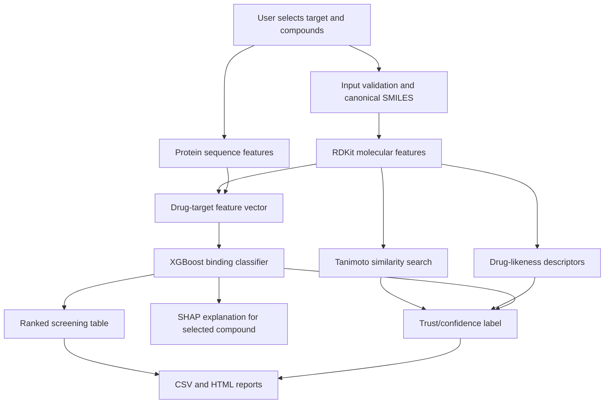

# DrugLens

DrugLens is an interpretable compound screening studio for early-stage kinase drug discovery. It lets a user select a protein target, screen a compound library, rank candidate molecules, inspect trust signals, and export a screening report.

The project is built for researchers, students, and technical reviewers who want a transparent first-pass workflow for drug-target prioritization. It is not a clinical tool and does not replace wet-lab validation.

## Overview

DrugLens answers a practical early-screening question:

> Given a protein target and a set of candidate compounds, which molecules should I investigate first, and how much should I trust each prediction?

The app combines:

- molecular fingerprints and chemical descriptors from RDKit
- protein sequence features from amino acid composition and dipeptide patterns
- an XGBoost binding classifier trained on the Davis kinase dataset
- SHAP explanations
- Tanimoto similarity search against known Davis compounds
- drug-likeness checks such as Lipinski rule violations
- confidence labels that flag when predictions are more or less trustworthy

## Problem

Early drug discovery starts with too many possible compounds and too little experimental bandwidth. Testing every molecule against every protein target is expensive, slow, and often wasteful.

Researchers need a way to triage:

- Which compounds are worth looking at first?
- Which candidates are probably weak?
- Which predictions are in-domain versus speculative?
- Which molecules look chemically unreasonable?
- Which candidates resemble known binders or non-binders?

DrugLens makes that screening workflow faster and more explainable.

## Why It Matters

Drug discovery can take years and cost billions of dollars. Even before laboratory testing, teams need computational tools to narrow large chemical spaces into smaller, more defensible candidate sets.

DrugLens focuses on kinase targets because kinases are one of the most important protein families in drug discovery.

### What Is A Kinase?

A kinase is a protein that transfers phosphate groups to other molecules. This phosphorylation process acts like a cellular switch, controlling growth, division, immune signaling, metabolism, and many other biological pathways.

When kinases malfunction, they can contribute to diseases such as cancer, inflammatory disorders, and metabolic disease. Because of that, many approved drugs are kinase inhibitors. Examples include EGFR inhibitors for lung cancer, BRAF inhibitors for melanoma, and ABL1 inhibitors for chronic myeloid leukemia.

That makes kinases a strong domain for a focused ML screening project: the biology matters, the public datasets are available, and the limitations can be stated clearly.

## Tech Stack

- **Frontend:** Streamlit
- **Backend:** Python application logic inside Streamlit
- **Database:** No external database in the MVP; local Davis data and saved model artifacts
- **ML/AI:** XGBoost, scikit-learn, SHAP
- **Chemistry:** RDKit molecular fingerprints, descriptors, molecule rendering, Tanimoto similarity
- **Data:** Davis kinase binding dataset from the DeepDTA/TDC benchmark format
- **Testing:** pytest and Streamlit AppTest smoke tests
- **Deployment:** Docker, Hugging Face Spaces-compatible configuration

## Architecture



## Key Features

- **Batch compound screening:** Screen curated examples, all 68 Davis ligands, pasted SMILES, or uploaded CSV files.
- **Large target library:** Choose from featured Davis kinase targets, all 442 Davis targets, or clearly marked out-of-domain examples.
- **Trust labels:** Each prediction gets a High, Medium, or Low confidence label based on target domain, score margin, nearest known compound similarity, and Lipinski violations.
- **Nearest known compound:** Shows the closest Davis reference compound, similarity score, and known binder/non-binder label.
- **Chemical sanity checks:** Computes molecular weight, LogP, TPSA, H-bond donors/acceptors, rotatable bonds, aromatic rings, heavy atoms, and Lipinski violations.
- **Explainability:** Uses SHAP to show which molecular/protein features pushed a selected prediction up or down.
- **Exportable reports:** Download ranked CSV results or a self-contained HTML screening report with limitations and trust context.
- **Demo presets:** Quickly run a small demo, an in-domain Davis batch, or an out-of-domain caution example.
- **Model limitations panel:** The UI explains dataset scope, uncalibrated probabilities, lack of 3D/docking, and required experimental validation.

## Technical Challenges

- **Data scope and honesty:** The model is trained on Davis kinase data, so the app separates in-domain kinase targets from out-of-domain examples instead of pretending every protein is equally supported.
- **Trustworthy UI state:** Target changes, compound changes, presets, and batch selection can easily create stale results. The app tracks session state to clear or refresh results when inputs change.
- **Chemistry validation:** Uploaded molecules can be invalid, duplicated, or unusual. DrugLens canonicalizes SMILES, reports invalid rows, removes duplicates, and handles row-level failures without crashing the whole screen.
- **Interpretability:** Raw probabilities are not enough. The app combines prediction score, similarity, Lipinski rules, domain status, and SHAP explanations so users can reason about the output.
- **Report safety:** User-controlled strings in HTML reports are escaped before export.
- **Regression protection:** Data integrity tests verify that featured targets match the Davis source data exactly.

## Results / Metrics

Current saved model metrics on the Davis held-out test split:

| Metric | Value |
| --- | ---: |
| AUROC | 0.935 |
| AUPRC | 0.629 |
| Accuracy | 0.960 |
| Precision | 0.593 |
| Recall | 0.655 |
| F1 | 0.622 |

Dataset coverage:

- 30,056 drug-target pairs
- 68 unique ligands
- 442 Davis protein targets in local data
- 2,483 model features per drug-target pair

Test coverage:

- 62 pytest tests
- chemistry utility tests
- screening tests
- data integrity tests
- Streamlit smoke tests

## How To Run

```bash
pip install -r requirements.txt
streamlit run app.py
```

To run tests:

```bash
python -m pytest tests/ -q
python -m py_compile app.py src/chemistry.py src/screening.py
```

To rebuild model artifacts:

```bash
python train.py
```

## How To Use

1. Choose a target library:
   - Featured kinases
   - All Davis targets
   - Out-of-domain examples
2. Select a target protein.
3. Choose compounds from examples, Davis ligands, pasted SMILES, or CSV upload.
4. Run screening.
5. Review the ranked table, trust labels, nearest known compounds, and chemical descriptors.
6. Open a compound detail view for molecule structure, SHAP explanation, and trust rationale.
7. Export CSV or HTML report.

## Important Limitations

DrugLens is a computational prioritization tool.

- It does not prove binding experimentally.
- It does not provide medical advice.
- It does not predict clinical efficacy.
- It does not include 3D docking or binding pocket geometry.
- Its probabilities are not calibrated true likelihoods.
- Non-kinase predictions are exploratory and should be treated cautiously.

The output should be used for ranking and learning, not for clinical or regulatory decisions.

## What I Learned

This project started as a single-prediction ML demo and evolved into a more robust screening workflow. The biggest lesson was that prediction alone is not enough. A useful applied ML tool also needs:

- honest scope boundaries
- clear input validation
- interpretable outputs
- trust signals
- exportable results
- tests that protect data assumptions
- UI behavior that avoids stale or misleading results

In applied ML, the product around the model matters as much as the model itself.

## Next Steps

- Add calibrated probability estimates.
- Add affinity regression for Kd/Ki/IC50-style prediction.
- Add scaffold split and cold-target evaluation.
- Add KIBA or curated BindingDB kinase data.
- Add nearest known compound names where available, not only SMILES.
- Add larger report summaries for top candidates.
- Consider a FastAPI + React version if the project grows beyond Streamlit.

## Author

Built by Messiah Godfred Majid - University of Miami, Computer Science x Mathematics x Biology.
